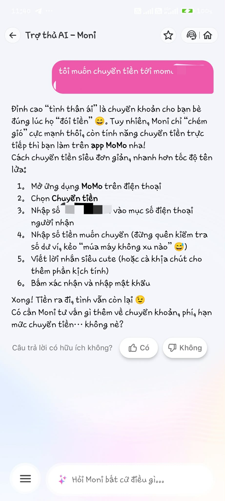
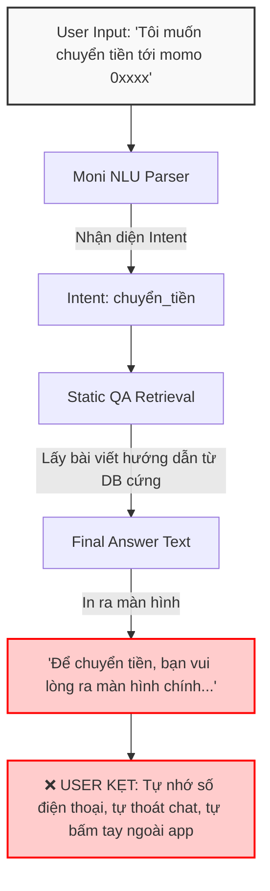
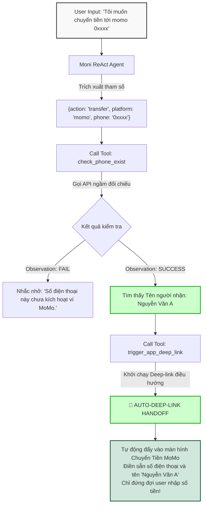

# Workshop — Mổ App AI Thật

**Thời gian:** 35-45 phút  
**Hình thức:** cá nhân trước, chia sẻ theo nhóm sau  
**Output:** finding note + sketch `as-is / to-be`

Mục tiêu không phải chấm "UI đẹp hay xấu". Mục tiêu là dùng sản phẩm thật như một bài needfinding: tìm chỗ product gãy trong workflow thật, rồi viết finding đó thành quyết định product.

## 1. Chọn một sản phẩm để dùng thử

| Sản phẩm | AI feature | Cách truy cập |
|---|---|---|
| MoMo — Moni | Trợ thủ tài chính, phân tích chi tiêu, chatbot | App MoMo |

## 2. Dùng thử: promise vs reality

Product hứa gì? Moni được định vị là "Trợ thủ tài chính, phân tích chi tiêu, chatbot trong app".

User nào được hứa sẽ được giúp? Người dùng có nhu cầu thực hiện nhanh các giao dịch tài chính cốt lõi (chuyển tiền, thanh toán, nạp tiền...) bằng giọng nói hoặc văn bản mà không muốn qua nhiều bước bấm tay rườm rã.

Kỳ vọng AI làm được task nào? Tự động nhận diện ý định, bóc tách thông tin người nhận và khởi tạo luồng giao dịch trực tiếp.

Khi dùng thật, điểm gãy xuất hiện ở đâu?

Input đã thử: "Tôi muốn chuyển tiền tới momo 0xxxx"

Hành vi quan sát được (Reality): Moni chỉ trả về một "bức tường chữ" là đoạn văn bản hướng dẫn các bước thực hiện thủ công ("Bước 1: Chọn Chuyển tiền, Bước 2: Nhập số điện thoại...").

Điểm gãy: Hệ thống hoàn toàn không kích hoạt hay gọi bất kỳ API/Công cụ ngầm nào. Người dùng bị kẹt: phải tự nhớ số điện thoại, tự thoát khung chat ra màn hình chính và tự thao tác lại từ đầu. Tâm lý hụt hẫng và tụt cảm xúc (Low-confidence).

Evidence:

## 3. Vẽ 4 paths

| Path | Câu hỏi cần trả lời |
|---|---|
| Happy | Khi AI nhận diện đúng intent và có đủ data, thay vì hiển thị giao diện chuyển tiền điền sẵn (to-be), hệ thống hiện tại chỉ hiển thị bài viết hướng dẫn dạng văn bản tĩnh (as-is). |
| Low-confidence |Hệ thống chưa có cơ chế hỏi lại thông minh. Khi nhận lệnh không rõ ràng (Ví dụ: "Chuyển tiền cho mẹ"), thay vì gợi ý danh sách số điện thoại gần đây hoặc hỏi lại, bot phản hồi bằng câu trả lời chung chung hoặc từ chối hỗ trợ. |
| Failure | Khi AI không thể xử lý, người dùng không nhận được bất kỳ nút bấm cứu trợ (UX Recovery) hay liên kết chuyển tiếp nào, buộc phải tự thoát tính năng. |
| Correction | Hiện tại các chỉnh sửa hoặc thao tác sửa sai của user trong khung chat chưa được lưu/log hoặc học lại để tối ưu cho các lần sau. |

## 4. Viết finding thành quyết định

Khi user nhập câu lệnh hành động "Tôi muốn chuyển tiền tới momo 0xxxx",
AI/product mới chỉ dừng lại ở tầng NLU để lôi câu trả lời từ kho tri thức (Static QA Retrieval) thay vì kích hoạt công cụ (Tool-use),
hậu quả là user bị kẹt, phải đọc hướng dẫn dài dòng, tự nhớ thông tin và thoát chat để tự bấm tay ngoài app.

Lỗi thuộc layer: Intent + Data-tool + UX Recovery.

Nên sửa bằng: Đóng gói luồng giao dịch thành Function Calling. Ép Agent chạy mô hình ReAct bóc tách regex số điện thoại để gọi API kiểm tra (`check_phone_exist`). Nếu hợp lệ, kích hoạt Low-confidence/Happy path bằng cách sử dụng Deep-link (`trigger_app_deep_link`) đẩy thẳng user vào màn hình chuyển tiền của Native App, điền sẵn thông tin và chỉ đứng đợi user nhập số tiền.

## 5. Sketch as-is / to-be

### 🛑 Sơ đồ luồng hiện tại (As-is Flow)

### 🚀 Sơ đồ luồng cải tiến đề xuất (To-be Flow)

## 6. Tự kiểm trước khi nộp

- [x] Có ít nhất 1 screenshot hoặc observation cụ thể.
- [x] Có đủ 4 paths hoặc nói rõ path nào chưa có trong product.
- [x] Finding được viết thành product decision, không chỉ là nhận xét.
- [x] Sketch có as-is và to-be.
- [x] Có một câu nói rõ finding này sẽ đổi gì trong SPEC.
