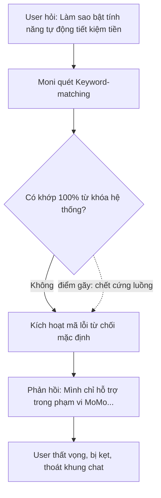
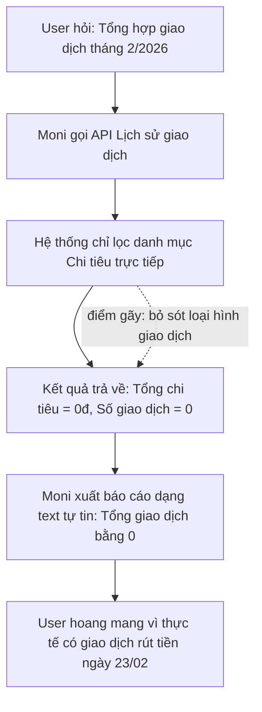
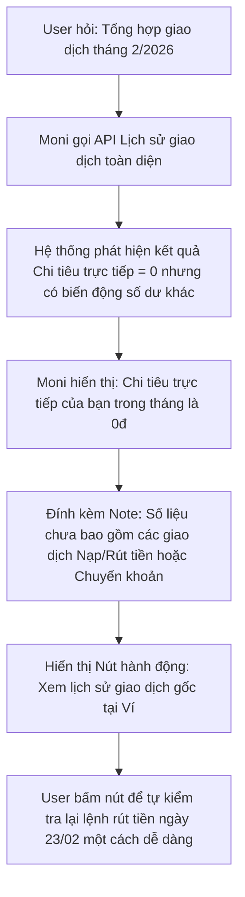
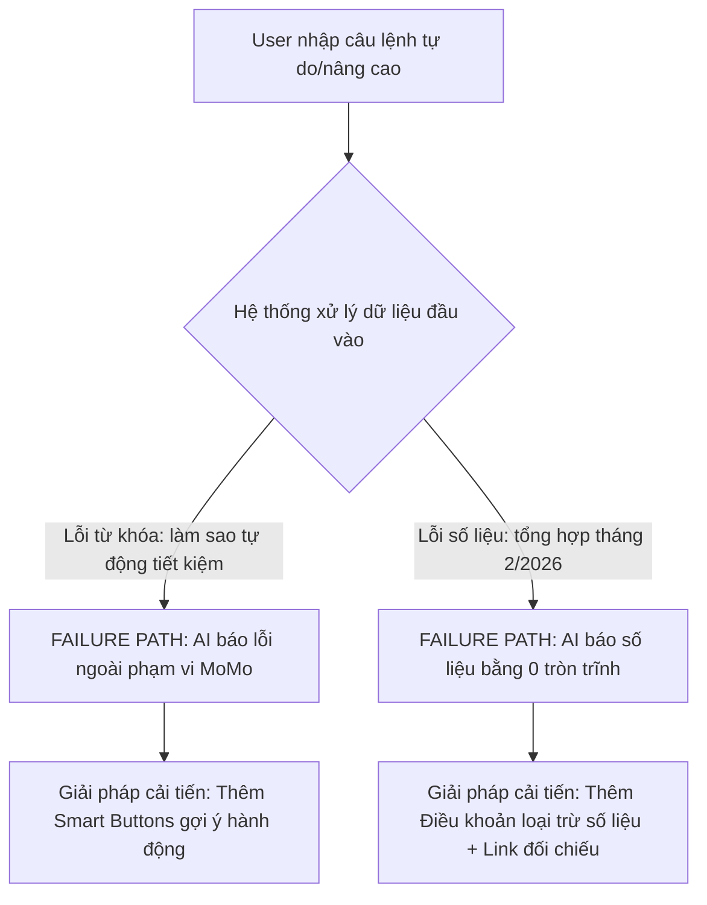

# Workshop — Mổ App AI Thật

**Sản phẩm được chọn:** MoMo — Moni
**AI feature:** Trợ thủ tài chính, phân tích chi tiêu, chatbot trong app MoMo
**Thời gian thực hiện:** 35-45 phút
**Hình thức:** cá nhân trước, chia sẻ theo nhóm sau
**Output:** finding note + sketch `as-is / to-be`

Mục tiêu không phải chấm "UI đẹp hay xấu". Mục tiêu là dùng sản phẩm thật như một bài needfinding: tìm chỗ product gãy trong workflow thật, rồi viết finding đó thành quyết định product.

---

## 1. Chọn một sản phẩm để dùng thử

| Sản phẩm               | AI feature                                     | Cách truy cập       |
| ---------------------- | ---------------------------------------------- | ------------------- |
| **MoMo — Moni**        | **Trợ thủ tài chính, phân tích chi tiêu, chatbot** | **App MoMo**       |
| Vietnam Airlines — NEO | Chatbot hỗ trợ vé, hành lý, khiếu nại          | Website/Zalo VNA    |
| V-App — V-AI           | Trợ lý voice/text, gợi ý theo ngữ cảnh         | App V-App           |
| App theo track nhóm    | App thật nhóm đang chọn cho hackathon          | Cần screenshot/link |

**Sản phẩm được chọn:** MoMo — Moni.

**Lý do chọn:**
Moni được định vị là một trợ thủ tài chính cá nhân thông minh tích hợp ngay trong siêu ứng dụng MoMo. Với lượng tính năng đồ sộ và giao diện ngày càng phức tạp của MoMo, kỳ vọng của người dùng đối với Moni là khả năng hiểu ngôn ngữ tự nhiên để định hướng dịch vụ (tiết kiệm, tích lũy) và xử lý/truy xuất dữ liệu tài chính cá nhân một cách nhanh chóng, chính xác mà không bắt user phải tự đi tìm kiếm thủ công.

---

## 2. Dùng thử: promise vs reality

### 2.1. Product hứa gì?

MoMo/Moni được kỳ vọng là một trợ lý AI có thể:

* Hỗ trợ người dùng tra cứu thông tin và kích hoạt dịch vụ bằng hội thoại tự nhiên.
* Phân tích chi tiêu, quản lý tài chính cá nhân thông minh, chính xác dựa trên dữ liệu thật của tài khoản.
* Giúp người dùng tiếp cận nhanh các giải pháp tích lũy, tiết kiệm trong app MoMo.
* Giúp giảm tải nhận thức (cognitive overload) cho người dùng trước một hệ sinh thái siêu ứng dụng quá nhiều tính năng.

### 2.2. User nào được hứa sẽ được giúp?

Nhóm user chính:

* Người dùng ứng dụng MoMo có nhu cầu quản lý tài chính cá nhân.
* Người muốn tìm kiếm và sử dụng nhanh các dịch vụ tích lũy/tiết kiệm (Túi Thần Tài, Tiết kiệm online).
* Người dùng phổ thông muốn có một trợ lý số xử lý hộ các tác vụ phức tạp liên quan đến số liệu.

### 2.3. Kỳ vọng AI làm được task nào?

Tôi kỳ vọng Moni có thể làm tốt các task sau:

1. **Nhận diện ý định (Intent) linh hoạt:** Hiểu được từ khóa đồng nghĩa hoặc các từ mô tả trạng thái tác vụ của người dùng (ví dụ: "tiết kiệm", "tự động tiết kiệm", "tích lũy").
2. **Tổng hợp dữ liệu tài chính chính xác:** Truy xuất chính xác lịch sử giao dịch (bao gồm cả nạp, rút, chuyển tiền, chi tiêu) để đưa ra báo cáo tổng hợp chuẩn theo thời gian thực.
3. **Kích hoạt giải pháp thay thế thông minh (Fallback path):** Khi gặp từ khóa chưa chắc chắn hoặc dữ liệu trống, AI phải biết hỏi lại hoặc gợi ý thay vì từ chối thẳng thừng hoặc đưa ra con số sai lệch.

---

## 2.4. Prompt/input đã thử

### Query 1 — Câu lệnh thông thường (Kiểm tra baseline)

```text
làm sao để bật tính năng tiết kiệm tiền.
```

### Query 2 — Câu lệnh nâng cao kèm từ mô tả (Kiểm tra tính linh hoạt của Intent)
```text
Làm sao để bật tính năng tự động tiết kiệm tiền.
```

### Query 3 — Tổng hợp giao dịch tài chính (Kiểm tra tích hợp dữ liệu hệ sinh thái MoMo)
```text
Tổng hợp giao dịch của tôi trong tháng 2 năm 2026.
```

## 2.5. Hành vi quan sát được

### Observation 1 — Query tính năng tiết kiệm thông thường
Moni nhận diện chính xác intent về dịch vụ "Tiết kiệm" và trả về kết quả có cấu trúc rất tốt gồm 4 bước rõ ràng:
1. Mở ứng dụng MoMo, chọn mục Tiết kiệm online trên màn hình chính.
2. Chọn gói tiết kiệm phù hợp.
3. Nhập số tiền muốn gửi và xác nhận.
4. Theo dõi tiến trình.

**Điểm gãy:** Không có. Đây là Happy path của hệ thống.

### Observation 2 — Query tính năng tiết kiệm có từ "tự động"
Khi user chỉ thêm duy nhất từ mô tả hành vi là "tự động" vào trước cụm từ cốt lõi, Moni hoàn toàn mất khả năng nhận diện ý định gốc ("tiết kiệm tiền"). Thay vì đưa ra hướng dẫn gần đúng hoặc kích hoạt luồng hỏi lại (Clarification), AI bật cơ chế tự vệ sai lầm bằng văn mẫu:
*"Mình là Moni, trợ lý ảo của MoMo. Mình chỉ có thể hỗ trợ trong phạm vi sản phẩm MoMo. Bạn cần giúp gì khác không?"*

**Điểm gãy:** AI bị bẫy "Keyword-matching" thô sơ, tự đẩy mình vào ngõ cụt trải nghiệm (Dead-end UX) và phủi bỏ trách nhiệm hệ thống (User đang chat trong MoMo nhưng AI lại bảo tính năng không thuộc phạm vi của MoMo).

### Observation 3 — Query tổng hợp giao dịch tháng 2/2026
Moni trả về cấu trúc báo cáo rất nhanh và tự tin:
*Tổng hợp giao dịch của bạn trong tháng 2 năm 2026 (2026-02-01 đến 2026-02-28): Total giao dịch: 0, Tổng số tiền đã chi: 0đ.*

Tuy nhiên, thực tế tài khoản của tôi có phát sinh một giao dịch rút tiền vào lúc 9h04 ngày 23/02/2026. AI đã hoàn toàn bỏ sót giao dịch này.

**Điểm gãy:** AI hiển thị dữ liệu trống (blank data) một cách quá tự tin nhưng sai thực tế do lỗi phân loại danh mục (chỉ quét lệnh "Chi tiêu", bỏ qua lệnh "Rút tiền" - một dạng biến động số dư). Hệ thống cũng không hề có dòng cảnh báo dữ liệu có thể chưa bao gồm các loại giao dịch khác ngoài chi tiêu trực tiếp.

---

## 3. Vẽ 4 paths

| Path | Câu hỏi cần trả lời | Quan sát trên MoMo — Moni |
| --- | --- | --- |
| **Happy** | Khi AI đúng và tự tin, user thấy gì? | AI trả lời có cấu trúc, mạch lạc khi user gõ đúng từ khóa hệ thống cần ("tiết kiệm tiền") hoặc trả về khung báo cáo có định dạng đẹp mắt. |
| **Low-confidence** | Khi AI không chắc, hệ thống có hỏi lại, show options hoặc chuyển người không? | Chưa thấy rõ. Khi gặp từ khóa "tự động", độ tự tin giảm, AI lập tức từ chối hỗ trợ bằng văn mẫu thay vì đưa ra các option gần đúng. |
| **Failure** | Khi AI sai, user biết bằng cách nào và sửa thế nào? | AI trả lời sai thực tế (báo giao dịch bằng 0 hoặc báo lỗi ngoài phạm vi MoMo). Không chỉ rõ phần nào chắc chắn, phần nào bị bỏ sót. User dễ bị lừa thông tin. |
| **Correction** | Khi user sửa, correction có được lưu/log/học lại không hay biến mất? | User buộc phải tự "hạ cấp" tư duy bằng cách xóa chữ "tự động" hoặc tự kiểm tra lịch sử gốc ngoài khung chat. Không thấy bằng chứng hệ thống học lại lỗi này. |

---

## 4. Finding thành quyết định product

### Finding 1 — Cơ chế Hard Keyword-Matching gây ra ngõ cụt UX (Dead-end)
Khi user thêm các tính từ hoặc từ mô tả hành vi (ví dụ: "tự động") vào trước tên tính năng cốt lõi, AI của Moni không bóc tách được từ khóa gốc mà lập tức kích hoạt câu trả lời từ chối mặc định, hậu quả là user bị chặn đứng trải nghiệm, hiểu lầm rằng ứng dụng không có tính năng này và thoát chat. Lỗi thuộc layer Intent Recognition + UX Fallback Recovery. Nên sửa bằng requirement: Khi điểm nhận diện Intent rơi vào vùng xám (Low-confidence), hệ thống tuyệt đối không dùng câu thoại phủ nhận diện rộng, mà phải chuyển đổi sang luồng gợi ý lựa chọn (Smart Suggestion Buttons).

**Product decision:**
Hủy bỏ câu thoại thoại từ chối cứng nhắc. Cần ưu tiên cơ chế Smart Options Grid khi gặp trạng thái low-confidence: Hiển thị tối thiểu 2-3 nút gợi ý liên quan đến từ khóa gốc (ví dụ: [Mở Tiết kiệm Online], [Tự động nạp Túi Thần Tài]) để định hướng user.

### Finding 2 — AI báo dữ liệu trống (Zero-data) quá tự tin nhưng sai bản chất giao dịch
Khi user yêu cầu tổng hợp giao dịch nhưng bộ lọc data-tool của AI chỉ quét danh mục Chi tiêu (Expense) và bỏ qua các biến động số dư khác (như Rút tiền), AI vẫn xuất báo cáo bằng 0 một cách chắc chắn mà không có dòng cảnh báo loại trừ, hậu quả là dữ liệu bị sai lệch hoàn toàn so với thực tế của ví user, làm sụt giảm nghiêm trọng lòng tin vào trợ lý tài chính. Lỗi thuộc layer Data-tool + UX Validation Cảnh báo. Nên sửa bằng requirement: Với mọi báo cáo trả về kết quả bằng 0 hoặc trống, hệ thống phải kích hoạt layer kiểm tra danh mục loại trừ, đính kèm ghi chú phạm vi quét dữ liệu và cung cấp shortcut link để user tự đối chiếu.

**Product decision:**
Moni cần được thiết kế như một context-aware assistant, không chỉ là chatbot đọc text. Khi hiển thị các số liệu nhạy cảm liên quan đến tiền bạc, nếu kết quả trả về bằng 0, product bắt buộc phải có cơ chế đệm trải nghiệm (UX Cushioning), giải thích rõ phạm vi tính toán số liệu và dẫn nguồn để user tự kiểm chứng.

---

## 5. Sketch as-is / to-be

### 5.1. Flow 1 — Truy vấn tính năng Tiết kiệm Tự động

**As-is**


**To-be**
```mermaid
flowchart TD
    A[User hỏi: Làm sao bật tính năng tự động tiết kiệm tiền] --> B[Moni trích xuất Semantic Intent]
    B --> C[Nhận diện Keyword gốc: Tiết kiệm | Keyword bổ trợ: Tự động]
    C --> D{Độ tin cậy Intent đạt bao nhiêu?}
    D -->|Thấp/Vùng xám| E[Kích hoạt Low-confidence Path: Gợi ý thông minh]
    E --> F[Moni: MoMo có các giải pháp tích lũy tự động sau, có phải bạn đang tìm?]
    F --> G[Hiển thị Nút: 1. Hướng dẫn Tiết kiệm Online | 2. Tự động nạp Túi Thần Tài]
    G --> H[User bấm nút chọn đúng nhu cầu]
    H --> I[AI trả về kết quả 4 bước hướng dẫn chi tiết]
```

### 5.2. Flow 2 — Tổng hợp giao dịch tháng 2/2026

**As-is**


**To-be**


---

## 6. Tổng hợp 4 paths cho MoMo — Moni

### 6.1. Quy trình xử lý lỗi hiện tại (Failure Path) vs Kỳ vọng (To-be Path)



---

## 7. Finding note cuối cùng

**Finding chính:**
Khi người dùng tương tác với Moni bằng câu lệnh ngôn ngữ tự nhiên tự do hoặc yêu cầu tổng hợp dữ liệu tài chính phức tạp, hệ thống AI của MoMo dễ bị sập bẫy quét từ khóa cứng nhắc và lỗi phân loại danh mục dữ liệu đầu ra. Hậu quả là chatbot trả về câu thoại phòng thủ đẩy user vào ngõ cụt, hoặc tệ hơn là cung cấp một báo cáo số liệu sai lệch hoàn toàn so với biến động số dư thực tế của ví.
Lỗi thuộc layer Intent Recognition + Data-tool Filter + UX Fallback Component.
Nên sửa bằng cách: Nâng cấp tầng xử lý ngôn ngữ, xây dựng UI Recovery dạng nút bấm điều hướng thông minh và thiết lập quy tắc đệm dữ liệu (Cushioning Note) đối với các báo cáo có kết quả trống (Zero-data).

**Product decision:**
Tuyệt đối không để AI đưa ra câu trả lời mang tính "chặn đứng" hoặc hiển thị số liệu trống một cách quá tự tin khi chưa xác dịch rõ bản chất tác vụ tài chính. SPEC sản phẩm cần bổ sung ngay cơ chế "UX Đệm trải nghiệm": Biến các lỗi nhận diện hệ thống và các kết quả zero-data thành luồng định hướng chủ động, minh bạch hóa phạm vi quét dữ liệu để bảo vệ lòng tin của người dùng.

---

## 8. SPEC change đề xuất

**Requirement 1 — Semantic Intent Extraction Over Keyword-Matching**
Moni không được phép sử dụng cơ chế so khớp từ khóa thô (Strict String Matching). Hệ thống phải bóc tách câu lệnh thành Intent gốc (Core Action) và Modifier (Từ bổ trợ).
*Ví dụ: "tự động tiết kiệm tiền" $\rightarrow$ Core Action = Tiết kiệm; Modifier = Tự động.*

**Requirement 2 — Low-Confidence Dynamic UI Component (Smart Buttons)**
Khi điểm tự tin của Intent dưới 70%, cấm sử dụng câu thoại text lỗi mặc định phủ nhận hệ thống.
Hệ thống bắt buộc phải hiển thị cấu trúc câu thoại mở kèm Grid nút bấm gợi ý hành động liên quan gần nhất (ví dụ: [Hướng dẫn Tiết kiệm Online], [Mở Túi Thần Tài]).

**Requirement 3 — Zero-Data Cushioning & Scope Validation**
Đối với các task liên quan đến số liệu tài chính, nếu API trả về kết quả bằng 0 (0đ chi tiêu, 0 giao dịch), hệ thống bắt buộc phải kích hoạt layer kiểm tra loại trừ và đính kèm dòng thông báo: "Lưu ý: Số liệu này chỉ tính trên danh mục Chi tiêu/Thanh toán, không bao gồm giao dịch Nạp/Rút tiền hoặc chuyển khoản nội bộ."
Bắt buộc phải tích hợp một Contextual Action Button: [Xem Lịch sử giao dịch gốc] nằm ngay dưới báo cáo bằng 0 để giảm thiểu nỗ lực (effort) tìm kiếm lại của user.

---

## 9. Tự kiểm trước khi nộp
- [x] Có ít nhất 1 screenshot hoặc observation cụ thể (Đã phân tích chi tiết 3 trường hợp đối chiếu thực tế).
- [x] Có đủ 4 paths hoặc nói rõ path nào chưa có trong product (Đã chỉ rõ Low-confidence path và Failure path còn thiếu sót).
- [x] Finding được viết thành product decision, không chỉ là nhận xét chung chung.
- [x] Sketch có đầy đủ mô hình luồng as-is và to-be cho cả 2 lỗi bằng Mermaid.
- [x] Có chương riêng nói rõ các điểm tìm thấy này sẽ thay đổi những gì trong SPEC sản phẩm.